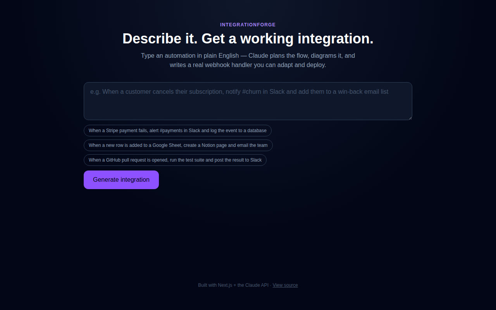

# IntegrationForge

Describe an automation in plain English — "when a Stripe payment fails, alert Slack and log it" —
and get back a flow diagram plus a real, runnable webhook handler implementing it.



**[Live demo](#)** · Built by [Deepa Venkat](https://github.com/) with Next.js and the Claude API

## Why this exists

A huge part of a Forward Deployed Engineer's job is translating a customer's plain-English
description of "what we need" into an actual working integration between systems, fast — often
in the first working session with them. This project is a small simulation of that: it takes the
customer's sentence, plans the trigger/steps/services, and produces code and a diagram a real
engineer could hand off or adapt on the spot.

What the model actually returns, via a forced tool call (`generate_integration`), not free text:

- a one-line **summary** and the **services** involved (rendered as chips)
- a **Mermaid flow diagram** of trigger → steps → outputs, rendered live in the browser
- a **runnable webhook handler** (Node/Express or Python/Flask) using real HTTP calls for the
  named services, with environment variables for credentials and comments marking what to fill in
- a plain **setup checklist** (which API keys to get, where to register the webhook, etc.)

## Stack

- **Next.js 16** (App Router) + TypeScript + Tailwind CSS
- **Claude API** (`@anthropic-ai/sdk`) using forced tool use for structured output
- **Mermaid** for client-side flow diagram rendering
- Deployed on **Vercel**

## Running it locally

```bash
npm install
cp .env.example .env.local   # then add your ANTHROPIC_API_KEY
npm run dev
```

Open [http://localhost:3000](http://localhost:3000) and try one of the example prompts, or
describe your own automation.

## Pushing to GitHub

```bash
git init
git add -A
git commit -m "Initial commit"
git branch -M main
git remote add origin https://github.com/<your-username>/integrationforge.git
git push -u origin main
```

(Create the empty `integrationforge` repo on GitHub first, without a README or .gitignore.)

## Deploying your own copy

1. Push this repo to your own GitHub account (see above).
2. Import it into [Vercel](https://vercel.com/new) — it auto-detects Next.js, no config needed.
3. Add an environment variable `ANTHROPIC_API_KEY` in the Vercel project settings.
4. Deploy.

## Notes / limitations

- Generated code is a strong first draft meant to be adapted, not a verified/tested integration —
  it doesn't actually call live Stripe/Slack/etc. accounts from this app.
- No code execution sandbox here; this generates and displays code rather than running it, which
  keeps the app simple and safe to deploy publicly.
